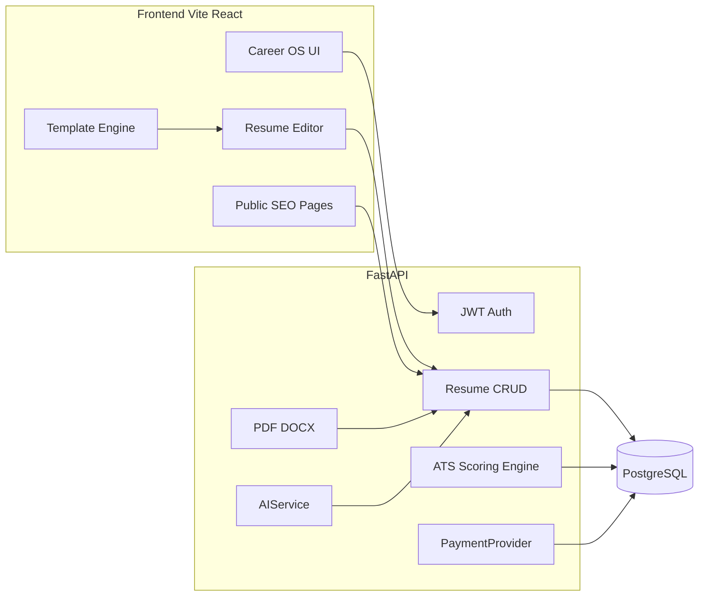

# ResumeForge — Production Build Plan

## Current state

The workspace at `C:\Users\deepa\OneDrive\Desktop\internship\resumeBuilder` is empty (no git repo, no existing code). Build the monorepo **in this directory** (do not nest a second `resume-forge/` folder).

## Product loop

The entire UI and IA are organized around **Career OS**, not a template marketplace:

**Build → Check → Improve → Match → Tailor → Export → Apply**

Every major screen answers “what should the user do next?” (dashboard Next Best Action, ATS Fix-it actions, builder Resume Health, export review).

## Architecture

**Monorepo layout**

- [frontend/](frontend/) — React 18 + TypeScript (strict) + Vite + Tailwind + React Router + Zustand + RHF + Zod + TanStack Query + `@dnd-kit` + Recharts + lucide-react
- [backend/](backend/) — FastAPI + Pydantic v2 + SQLAlchemy 2 + Alembic + PostgreSQL
- [docker/](docker/) — production Dockerfiles + NGINX
- [docs/](docs/) — architecture notes
- [docker-compose.yml](docker-compose.yml), [.env.example](.env.example), [README.md](README.md)

## Key technical decisions

- **Auth:** Email/password now; `OAuthAccount` table reserved for later providers. Access JWT (short) + rotating refresh tokens stored hashed in DB. Frontend keeps access token in memory; refresh via httpOnly cookie where possible.
- **Resume data:** One canonical `ResumeData` TypeScript + Pydantic model (JSONB on `resumes.data` / `resume_versions.data`). Editor, preview, ATS, parser, PDF, and DOCX all consume this model. No per-template editors.
- **Templates:** 44 templates composed from shared primitives (`ResumeHeader`, `ResumeSection`, `ResumeExperience`, …). Genuine layout families (classic single-column, modern ATS, executive, tech/skills-forward, academic, fresher/education-first, bold header, split, sidebar). Sidebar/two-column templates labeled **ATS Compatibility: Good** — never “guaranteed.”
- **Live preview:** Same React template components as the editor. Selectable text. A4/Letter, zoom, page bounds, multi-page. Print CSS for clean print.
- **PDF:** Playwright/Chromium `page.pdf()` from the same HTML/CSS as the preview (selectable text, not screenshots). Fallback: browser print path for local-dev without Chromium if needed, documented in README.
- **DOCX:** `python-docx` from `ResumeData` with simple heading/paragraph/bullet structure (ATS-safe). Visual two-column layouts are flattened in Word.
- **ATS engine:** Modular, configurable weights (default Formatting 20 / Keywords 30 / Content 20 / Experience 15 / Skills 10 / Completeness 5). Rule-based + keyword extraction. Disclaimer on every score. Quality bands: Excellent / Good / Needs Improvement / Needs Major Improvement.
- **Parser:** `pypdf`/`pdfplumber` + `python-docx` + heuristic section detection. Always show “Review imported content before downloading.”
- **AI:** `AIService` provider interface (`OpenAICompatibleProvider` + `RuleBasedProvider`). If `AI_API_KEY` is missing, rule-based improve/shorten/grammar still works and never fabricates facts/metrics.
- **Payments:** `PaymentProvider` interface (`StripeProvider`, `RazorpayProvider`, `NoopProvider`). Local/dev uses Noop + manual plan switch for admins. No hardcoded credentials.
- **Email:** `EmailProvider` (`SMTP` / `ConsoleProvider`) for verify + reset. App runs without SMTP.
- **Rate limits:** SlowAPI in-process; plan-based quotas on ATS, AI, export, import. Redis only if we add it later — not required.
- **i18n:** `i18next` from day one; English default; string catalog so Hindi can be added later.
- **Design:** CSS variables / Tailwind tokens. Near-black + slate + one electric indigo accent. Light/dark for **app chrome only**; resume canvas stays print-white.
- **Ads:** Slot components on blog / examples / template discovery only. Never inside the editor.

## Data model (PostgreSQL)

Core tables from the spec, plus fields needed for the product:

- `users` — spec fields + `role` (`user` | `admin`) + `onboarding` JSON
- `resumes` — spec + `is_deleted`, `download_count`, `section_order`
- `resume_versions` — spec
- `templates` — spec metadata (slug, category, ats_rating, layout, is_premium, template_config)
- `job_descriptions` — spec
- `ats_reports` — spec
- `subscriptions` — spec
- Extra (needed, keep lean): `refresh_tokens`, `blog_posts`, `applications` (saved/applied/interview/offer/rejected/withdrawn — secondary tracker), `audit_events` (admin usage)

Alembic migrations from the first backend commit. Seed: 44 templates, sample `ResumeData`, sample JDs, 8–10 blog posts, 24 example-role content files. No real PII.

## Frontend IA

**Public:** `/`, `/resume-builder`, `/resume-templates`, `/resume-template/:slug`, `/ats-resume-checker`, `/resume-checker`, `/job-description-matcher`, `/resume-examples` + 24 role slugs, `/pricing`, `/blog`, `/blog/:slug`, `/about`, `/contact`, `/privacy`, `/terms`, `/cookies`, plus SEO aliases (`/free-resume-builder`, `/ats-resume-template`).

**App:** `/dashboard`, `/resume/:id/edit`, `/settings`, `/onboarding`, admin `/admin/*`.

**Auth:** `/login`, `/register`, `/forgot-password`, `/reset-password`, `/verify-email`.

Design system primitives first: Button, Input, Modal, Drawer, Toast, Skeleton, EmptyState, ScoreRing, CommandPalette, Sheet, Badge, KeywordChip, IssueCard, etc.

Builder: 3-panel desktop / 2-panel tablet / accordion + preview toggle + bottom sheet on mobile. App chrome has bottom nav on mobile (Home / Resumes / ATS / Jobs / Profile). `@dnd-kit` for section reorder. Autosave with `● Saved` / `◌ Saving...`. Undo for section delete. Shortcuts: Cmd/Ctrl+S, +K (command palette), +Z / Shift+Z, Esc.

## Backend API (representative)

All endpoints: Pydantic request/response, auth where required, structured errors, no raw stack traces.

- `GET /health` → `{ "status": "ok" }`
- Auth: register, login, logout, refresh, forgot/reset, verify
- Resumes: CRUD, duplicate, versions, restore, import, JSON export
- `POST /api/ats/analyze`, `POST /api/ats/job-match`
- `POST /api/export/pdf`, `POST /api/export/docx`
- Templates, jobs, subscriptions (checkout/webhook/cancel), blog, admin analytics
- FastAPI OpenAPI at `/docs`

## Phase execution (after approval)

Implement **in this order**. After each phase: frontend typecheck/build, backend pytest, fix errors before continuing.

### Phase 1 — Foundation
Monorepo, Docker Compose (frontend, backend, postgres), `.env.example`, design tokens, layouts, i18n shell, FastAPI app, SQLAlchemy models, Alembic, JWT auth, CORS, security headers, rate-limit skeleton, seed runner, health check.

### Phase 2 — Resume core
`ResumeData` shared types, section registry (all 23+ section types), editor 3-panel, RHF+Zod forms, hide/show/rename/reorder, autosave, version snapshots, personal/experience/education/skills/projects/certs + remaining sections.

### Phase 3 — Template engine
Primitives + 44 working templates + settings (font, sizes, margins, accent, date format, A4/Letter) + live preview (zoom, pages, fit-to-1/2 without unreadably small fonts) + template gallery filters/search/sort + per-template SEO pages. Default: Classic ATS, A4, conservative type.

### Phase 4 — Export
Playwright PDF, python-docx DOCX, print CSS, filename `FirstName_LastName_Resume.{pdf,docx}`, export progress UI, final review gate (completeness + issues).

### Phase 5 — ATS + parser
Upload PDF/DOCX/paste, formatting analysis (GOOD/WARNING/CRITICAL + priority), keyword analysis, completeness, content checker (weak verbs, passive, generic, bullet length), ScoreRing + Health report + Fix-it CTAs, import-to-builder with review banner. File validation: type, MIME, size; reject executables/scripts.

### Phase 6 — Job matcher
JD extract + weighted match, side-by-side comparison, report sections (required/preferred, missing, experience/education, recommendations, placement guidance — no stuffing). “Create Tailored Version” duplicates resume named for the job. Application Workspace groups resume + JD + reports + status.

### Phase 7 — AI
`AIService` methods from spec, contextual floating toolbar (not a chatbot), Resume Copilot side panel, summary generator tones, “AI-generated — review before using.” Rule-based fallback without API keys.

### Phase 8 — Dashboard / Career OS
Greeting + Next Best Action, Resume Health, recent resumes/reports/JDs, plan status, card actions (edit/duplicate/rename/download/delete/ATS/versions), analytics (score history, most-used template, download counts), onboarding (role + experience → template recs), command palette, global search.

### Phase 9 — Monetization
Free vs Pro gates (limits, premium templates, advanced ATS, job match, AI, DOCX, versions) without breaking the editor. Pricing page. PaymentProvider + webhooks + subscription lifecycle. Locked-feature UI with Upgrade CTA.

### Phase 10 — SEO + content
Helmet/meta + canonical + OG/Twitter + JSON-LD (WebSite, WebPage, BreadcrumbList, FAQPage, Article). `sitemap.xml`, `robots.txt`. Landing (interactive ATS hero, no competitor clone). Blog CMS + seed posts. 24 example pages (fictional samples only). Internal linking. FAQ. Cookie consent (no non-essential tracking before consent). Ad slots on content pages only.

### Phase 11 — Admin
Protected `/admin`: users, subscriptions, templates enable/disable, blog, ATS/AI usage, errors, pricing. Analytics: users, resumes, checks, matches, exports, conversion. Role checks on every admin route.

### Phase 12 — Hardening
Backend tests (auth, CRUD, ATS, keywords, match, upload, export). Frontend tests (validation, template render, reorder, ATS results). Security pass (bcrypt, JWT rotation, upload limits, XSS/SQL, headers). Performance (code-split templates, lazy routes, pagination). Production Dockerfiles (non-root), NGINX (SPA + `/api` proxy + gzip + cache + headers), healthchecks, migrate-on-start, logging. README. Full local + Docker verification.

## Local-without-paid-services defaults

App must run with only Postgres:

- Console email (links printed in backend logs)
- Rule-based AI
- Noop payments (admin can set plan)
- Playwright image optional; document `docker compose --profile export` if Chromium is heavy

## Design identity (non-negotiable)

Do **not** clone Canva / Resume.io / Novoresume / Enhancv / Zety. Career OS: large type, whitespace, subtle borders, restrained indigo accent, 150–250ms motion, `prefers-reduced-motion`. Resume output never goes dark. Distinctive ScoreRing, ATS pipeline visualization, immersive live template cards (real components, not fake screenshots).

## Out of scope for v1 (architecture only)

OAuth login buttons (schema ready), live Stripe/Razorpay charges without keys, Hindi translations (catalog ready), Redis, real ad-network scripts (slots only).

## Verification

After the last phase, run frontend build + tsc, backend pytest, Alembic upgrade, Docker Compose up, and exercise: register → Classic ATS → edit → autosave → ATS check → job match → tailor → PDF/DOCX. Browser-verify landing, builder (desktop + mobile width), dashboard, ATS report, and pricing.
